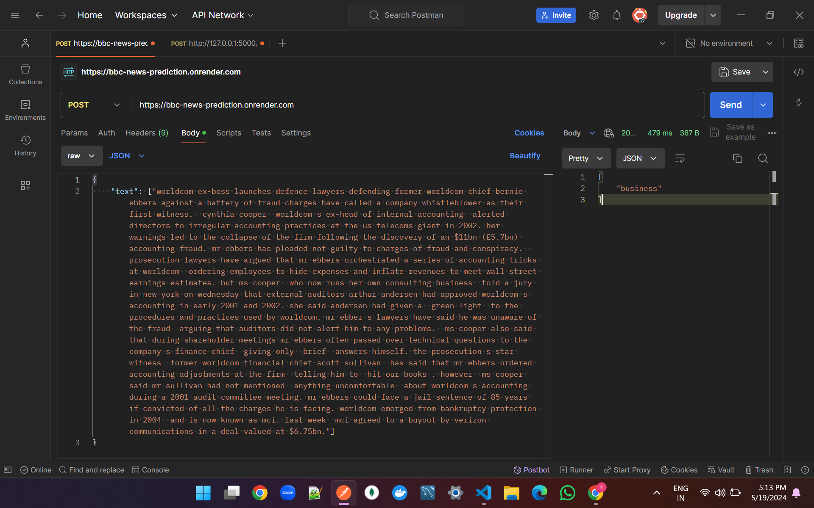

# BBC_news_prediction

Installation Setup

```bash
pip install -r requirements.txt
```

to run python server local

```bash
py app.py
```

the server has one endpoint to predict the BBC news category.

```
Method: POST
URL:http://127.0.0.1:5000/

body: {
    "text": ["statement1", "statement2"]
}

Result: [
    "business"
]
```

OUTPUT


